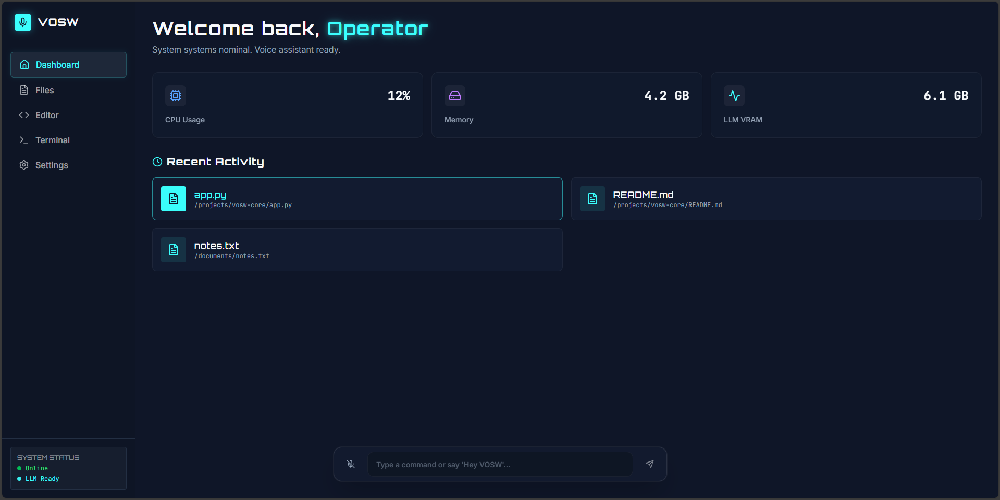
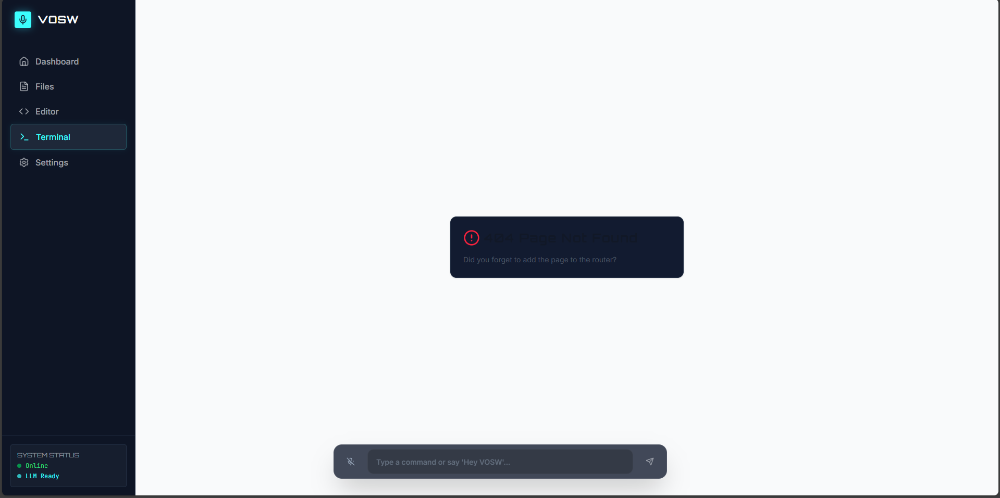
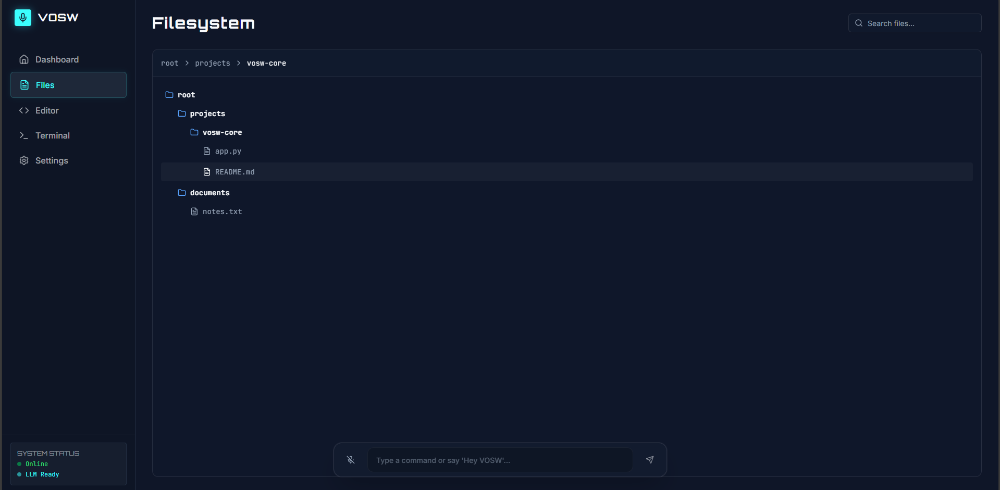

# **VOSM — Voice-Operated Smart Workspace**

VOSM (Voice-Operated Smart Workspace) is a next-generation productivity web application that lets users **control their computer with voice and text commands**.  
Built using **React (frontend)** and **Flask (backend)**, it provides a seamless interface for hands-free workspace control, file management, document creation, and AI-powered actions — all from within the browser.

VOSM is designed for developers, researchers, writers, and anyone who wants to boost workflow efficiency through intelligent voice interaction.

---

## 🖼️ Project Screenshots

### **🔷 Dashboard Preview**


### **🎤 Voice Command Interface**


### **📂 File Manager**


*(Place your images in an `/assets` folder or update the paths accordingly.)*

---

## 🚀 Key Features

### 🎤 Voice & Text Command Control
- Execute system-level tasks using natural voice commands.
- Supported actions:
  - “Create file notes.txt”
  - “Search for images”
  - “Open VS Code”
  - “Write a report on AI ethics”
  - “Generate a React component”

### 📁 Smart File Management
- Create, edit, search, and manage files/folders.
- Sandboxed workspace for safety.
- Supports structured file creation (Python, text files, docs).

### 🤖 AI-Powered Content Generation
- Generate reports, summaries, or code using a local AI model.
- Converts natural-language commands into real actions.

### 🖥 System Control via Allowlist
- Securely execute OS-level actions like opening approved apps.
- Uses allowlisting for protection.

### 🔄 Real-time Interaction
- Flask-SocketIO for:
  - Live voice streaming
  - Command execution feedback
  - Real-time results

### 🔐 Security Focus
- Safe command executor  
- Path validation  
- No unsafe shell commands  
- Sandboxed folder operations  

---

## 🏗 Tech Stack

### **Frontend**
- React  
- Socket.IO client  
- Web Audio API (voice recording)  
- REST API integration  

### **Backend**
- Flask  
- Flask-SocketIO  
- Python file management  
- Optional: Whisper (STT)  
- Optional: LlamaCpp / GPT4All (local AI)

---

## 📂 Project Structure

```bash
VOSM/
│── frontend/        # React UI
│── backend/         # Flask API + SocketIO
│── workspace/       # Sandboxed user files
│── assets/          # Images for README
│── README.md
